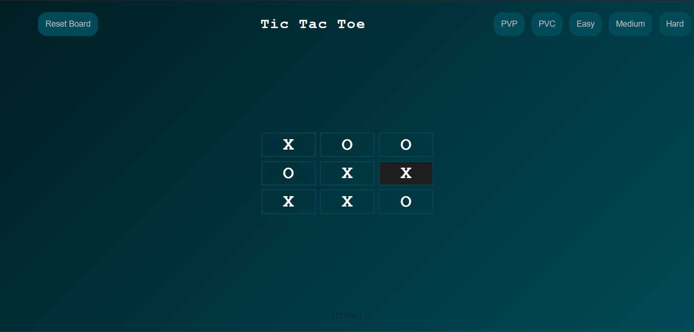

# 🎲 Tic Tac Toe (Web Version)



A **Tic Tac Toe** game built using **HTML, CSS, and JavaScript**, supporting **Player vs Player (PVP)** and **Player vs CPU (PVC)** modes. The CPU has three difficulty levels: **Easy**, **Medium**, and **Hard (Minimax AI)**.

---

## 🚀 Features

- **Two Game Modes**
  - **PVP:** Two players take turns on the same device.
  - **PVC:** Play against the computer.
- **CPU Difficulty Levels**
  - 🧸 **Easy:** Random moves.
  - 🧠 **Medium:** Blocks player or tries to win.
  - 🤖 **Hard:** Optimal moves using **Minimax algorithm**.
- **Reset Board** button to restart quickly.
- Responsive layout for desktops and tablets.
- Clean, modular JS for easy learning and customization.

---

## 🛠️ Installation & Running Locally

1. **Clone the repository**

```bash
git clone https://github.com/yourusername/tic-tac-toe.git
```
2. **Navigate into the folder**
```bash
cd tic-tac-toe
```
3. **Open index.html in your browser**

## 🎮 How to Play
1. **Open the game in your browser.**
2. **Select your game mode: PVP or PVC.**
3. **If playing against CPU, select a difficulty level:**
      * Easy → Random moves 🧸
      * Medium → Blocks your winning moves or wins if possible 🧠
      * Hard → Plays optimally with Minimax AI 🤖
4. **Click on an empty cell to place your mark (X or O).**
5. **The game will announce a win or draw automatically.**
6. **Click Reset Board to restart without changing the mode.**

## 🧠 Game Logic Overview

* The board is represented as an array of 9 cells.
* Players alternate turns between X and O.
* After each move, the game checks for win or draw.
* CPU Logic:
* Easy: Random available cell.
* Medium: Attempts to win or block player’s winning move, otherwise random.
* Hard: Uses Minimax algorithm to simulate all possible future outcomes and choose the optimal move.

## 📂 Project Structure
```
tic-tac-toe/
  ├─ index.html       # Main HTML file
  ├─ style.css        # CSS for game layout and styling
  ├─ script.js        # JavaScript game logic and AI
  ├─ README.md        # Project documentation
  ├─ screenshot.png   # Optional: Screenshot or GIF of the game
```
## 📝 Author
  * Shivam – Front-end Developer & AI enthusiast
